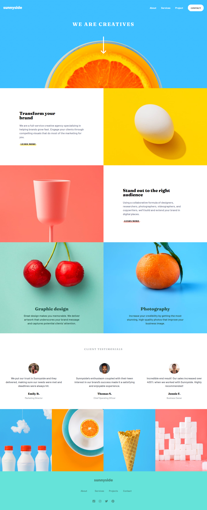

# Frontend Mentor - Sunnyside agency landing page solution

This is a solution to the Sunnyside agency landing page challenge on Frontend Mentor by yishak abrham.

## Table of contents

- [Overview](#overview)
  - [The challenge](#the-challenge)
  - [Screenshot](#screenshot)
  - [Links](#links)
- [My process](#my-process)
  - [Built with](#built-with)
  - [What I learned](#what-i-learned)
  - [Continued development](#continued-development)
  - [Useful resources](#useful-resources)
- [Author](#author)
- [Acknowledgments](#acknowledgments)

## Overview

Home page design

### The challenge

Users should be able to:

- View the optimal layout for the site depending on their device's screen size
- See hover states for all interactive elements on the page
- use JS to toggle the menu nav for mobile screens

### Screenshot



### Links

- Solution URL: [Add solution URL here](https://your-solution-url.com)
- Live Site URL: [Add live site URL here](https://your-live-site-url.com)

## My process

the process is pretty basic using grid and flex layout designs but for the hover effect on the buttons take some serious work and creativity.

### Built with

- Semantic HTML5 markup
- CSS custom properties
- Flex
- CSS Grid
- Mobile-first workflow
- Javascript

### What I learned

it help me to build new skill on the `samp` element that is added inside a button element so that we can add another psudoelement on the button (later used to hover) so its pretty usefull skill to have

```html
<button class="btn btn-contact" type="button">
  <samp> contact </samp>
</button>
```

first we position the btn `relative` and overflow `hidden`

```css
.btn-contact {
  position: relative;
  overflow: hidden;
}
```

and also position the samp element `relative`

```css
.btn-contact samp {
  position: relative;
  z-index: 1;
  font-size: 0.8rem;
  font-family: 'Fraunces', serif;
}
```

there is some serious work on the css for the psudo element :after btn ...we position the after element absolute to the btn and samp so that it stays under the btn ..i use the transform property to the decoration purpose

```css
.btn-contact::after {
  content: '';
  position: absolute;
  left: 0;
  top: 0;
  height: 230%;
  width: 150%;
  background-color: $btn_hover_color;
  transition: 0.5s;
  transform: translate(-98%, -25%) rotate(45deg); /*translate x and y*/
}
```

finally when we hover over the btn the after element will move to the desired position behind the btn

```css
.btn-contact:hover::after {
  transform: translate(-9%, -25%) rotate(45deg);
}
```

another cool thing that i practice is mastering my css clip path skill which used to snip the polygon by `clip-path ` property..

```css
clip-path: polygon(
  0 6%,
  //x=0 y=6%
  95% 6%,
  //x=95% y=6%
  100% 0,
  //x=100% y=0
  100% 100%,
  //x and y =100%
  0% 100% //x=0% y=100%
); //<!--TODO: the first number X-axis and the second number Y-axis ... co-ordinate from the top left of polygone(0,0)
display: none;
```

finally i add the fixed nav bar functionallity to the page by comparing the nav height to the pageYOffset...

```js
const navBar = document.getElementById('nav');
const navHeight = navBar.getBoundingClientRect().height; //103px for pc
const topLink = document.querySelector('.top-link');
window.addEventListener('scroll', function () {
  const scrollHeight = window.pageYOffset;

  if (scrollHeight > navHeight) {
    navBar.classList.add('fixed-nav');
  } else {
    navBar.classList.remove('fixed-nav');
  }
  //top link
  if (scrollHeight > 500) {
    topLink.classList.add('show-link');
  } else {
    topLink.classList.remove('show-link');
  }
});
```

### Continued development

inpage navigation using getBoundingClientRect() method.

## Author

- Frontend Mentor - [@yishak621](https://www.frontendmentor.io/profile/yourusername)

## Acknowledgments

thanks to frontend mentor
